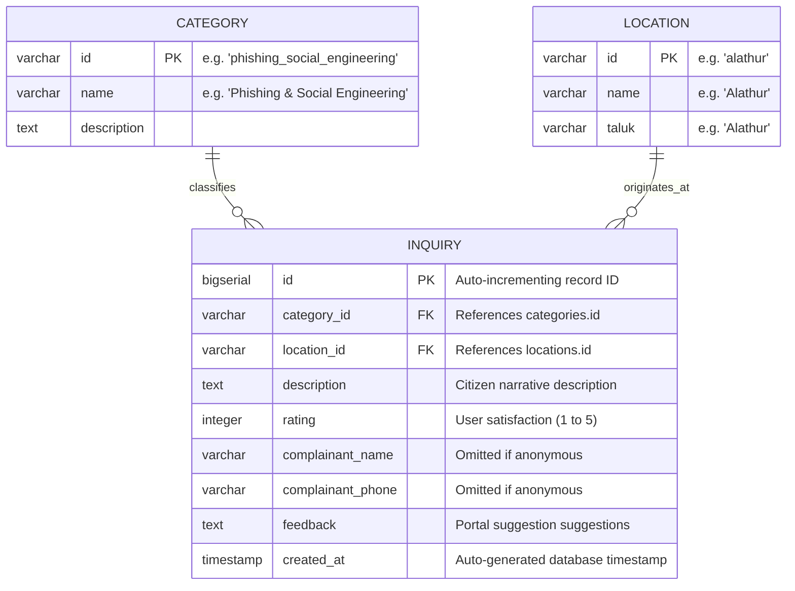

# Optimal Minimal Database Schema

This document outlines the database schema designed to support the **Cybercrime Inquiry Portal**. It has been stripped of unnecessary complexities (like platforms and subcategories) to form a minimal, performant relational design optimized for fire-and-forget portal feedback submissions.

---

## 📊 Entity Relationship Diagram (ERD)



---

## 📂 ASCII Relationship Diagram

```text
  +---------------------------------------------+
  |                 categories                  |
  +---------------------------------------------+
  | PK  | id          : VARCHAR(100)            | <----------+
  |     | name        : VARCHAR(255)            |            |
  |     | description : TEXT                    |            |
  +---------------------------------------------+            |
                                                             |
  +---------------------------------------------+            |
  |                  locations                  |            |
  +---------------------------------------------+            |
  | PK  | id          : VARCHAR(100)            | <-----+    |
  |     | name        : VARCHAR(255)            |       |    |
  |     | taluk       : VARCHAR(100)            |       |    |
  +---------------------------------------------+       |    |
                                                        |    |
  +---------------------------------------------+       |    |
  |                  inquiries                  |       |    |
  +---------------------------------------------+       |    |
  | PK  | id                : BIGSERIAL         |       |    |
  | FK  | category_id       : VARCHAR(100)      |-------+----+
  | FK  | location_id       : VARCHAR(100)      |-------+
  |     | description       : TEXT              |
  |     | rating            : INTEGER           |
  |     | complainant_name  : VARCHAR(255)      |
  |     | complainant_phone : VARCHAR(20)       |
  |     | feedback          : TEXT              |
  |     | created_at        : TIMESTAMP         |
  +---------------------------------------------+
```

---

## 🗄️ Table Definitions

### 1. `categories` (Master Classification)
Holds primary category classification records. Contains standard entries plus a fallback `'other'` row.

| Column | Type | Constraints | Description |
| :--- | :--- | :--- | :--- |
| `id` | `VARCHAR(100)` | `PRIMARY KEY` | Snake-cased ID code (e.g., `'phishing_social_engineering'`, `'other'`). |
| `name` | `VARCHAR(255)` | `NOT NULL`, `UNIQUE` | Display category name. |
| `description` | `TEXT` | `NOT NULL` | official help guideline details. |

### 2. `locations` (Master Locations)
Master list of the Palakkad district locations (taluks, towns). Contains standard entries plus a fallback `'other'` row.

| Column | Type | Constraints | Description |
| :--- | :--- | :--- | :--- |
| `id` | `VARCHAR(100)` | `PRIMARY KEY` | Snake-cased unique code (e.g. `'alathur'`, `'other'`). |
| `name` | `VARCHAR(255)` | `NOT NULL` | Local area name. |
| `taluk` | `VARCHAR(100)` | `NOT NULL` | Parent Taluk region name. |

### 3. `inquiries` (Submissions Feedback)
Main table where feedback submissions are logged.

| Column              | Type           | Constraints                                         | Description                      |
| :--------------------| :---------------| :----------------------------------------------------| :---------------------------------|
| `id`                | `BIGSERIAL`    | `PRIMARY KEY`                                       | Auto-incrementing primary key.   |
| `category_id`       | `VARCHAR(100)` | `NOT NULL`, `FOREIGN KEY REFERENCES categories(id)` | Associated category code.        |
| `location_id`       | `VARCHAR(100)` | `NOT NULL`, `FOREIGN KEY REFERENCES locations(id)`  | Associated location code.        |
| `description`       | `TEXT`         | `NOT NULL`                                          | Citizen description.             |
| `rating`            | `INTEGER`      | `NOT NULL`, `CHECK (rating >= 1 AND rating <= 5)`   | Service evaluation rating.       |
| `complainant_name`  | `VARCHAR(255)` | `NULLABLE`                                          | Complainant name (if provided).  |
| `complainant_phone` | `VARCHAR(20)`  | `NULLABLE`                                          | Complainant phone (if provided). |
| `feedback`          | `TEXT`         | `NULLABLE`                                          | UI/Portal improvement feedback.  |
| `created_at`        | `TIMESTAMP`    | `DEFAULT CURRENT_TIMESTAMP`                         | Log insertion time.              |

---

## 💻 SQL DDL (PostgreSQL Schema)

```sql
-- Create classification category lookup master table
CREATE TABLE categories (
    id VARCHAR(100) PRIMARY KEY,
    name VARCHAR(255) NOT NULL UNIQUE,
    description TEXT NOT NULL
);

-- Create locations lookup master table
CREATE TABLE locations (
    id VARCHAR(100) PRIMARY KEY,
    name VARCHAR(255) NOT NULL,
    taluk VARCHAR(100) NOT NULL
);

-- Create inquiries feedback table
CREATE TABLE inquiries (
    id BIGSERIAL PRIMARY KEY,
    category_id VARCHAR(100) NOT NULL REFERENCES categories(id) ON UPDATE CASCADE,
    location_id VARCHAR(100) NOT NULL REFERENCES locations(id) ON UPDATE CASCADE,
    description TEXT NOT NULL,
    rating INTEGER NOT NULL CHECK (rating >= 1 AND rating <= 5),
    complainant_name VARCHAR(255),
    complainant_phone VARCHAR(20),
    feedback TEXT,
    created_at TIMESTAMP NOT NULL DEFAULT CURRENT_TIMESTAMP
);

-- Ensure fallback seed values exist in tables
INSERT INTO categories (id, name, description) VALUES ('other', 'Other', 'Select this category if your inquiry does not match standard options.');
INSERT INTO locations (id, name, taluk) VALUES ('other', 'Other', 'Other');
```

---

## ⚡ Index Optimization

To guarantee efficient lookup speeds when querying the logs (e.g. for analytical/report dashboards):

1. **Foreign Keys Indexes**:
   ```sql
   CREATE INDEX idx_inquiries_category ON inquiries(category_id);
   CREATE INDEX idx_inquiries_location ON inquiries(location_id);
   ```
2. **Date Range Sorting**:
   ```sql
   CREATE INDEX idx_inquiries_created_at ON inquiries(created_at DESC);
   ```
